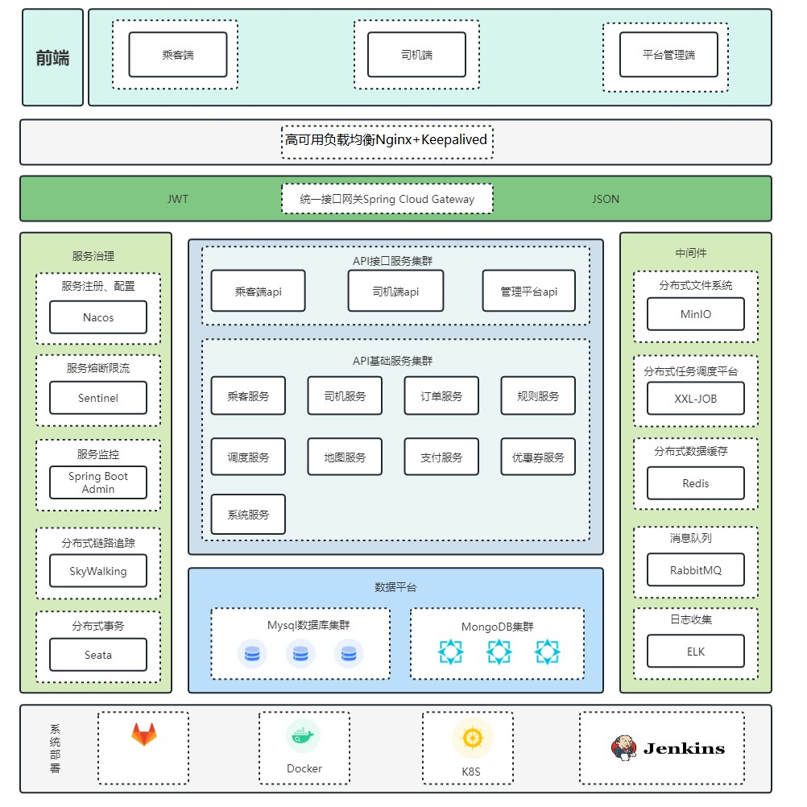
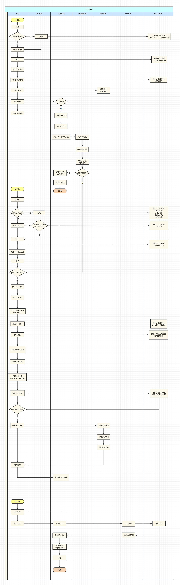
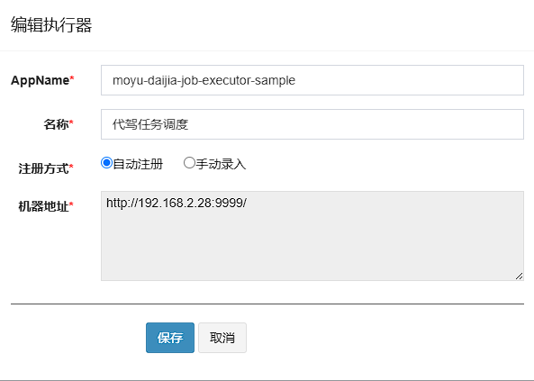

## **代驾项目**


#### **项目架构图**
-----------------------------------------------------------------------------------------------


#### **核心业务流程图**
-----------------------------------------------------------------------------------------------

#### **技术栈**
-----------------------------------------------------------------------------------------------

| 技术栈           | 版本 |
|---------------|:--|
| JDK           | 17 |
| SpringBoot    | 3.0.5 |
| SpringCloud   | 2022.0.2 |
| MySQL         | 5.7 |
| MongoDB       | 7.0.0 |
| Redis         | 7.4.2 |
| MyBatis-Plus  | 3.5.3 |
| RabbitMQ      | 4.0.7 |
| Nacos         | 2.1.1 |
| Seata         | 1.7.0 |
| XXL-Job         | 2.4.0 |
| Redisson         | 3.23.3 |


#### **第三方服务**
-----------------------------------------------------------------------------------------------

| 服务          | 地址  |
|-------------|-----|
| 腾讯云身份证识别    | https://cloud.tencent.com/document/product/866/103433    |
| 腾讯云行驶证识别    | https://cloud.tencent.com/document/product/866/36209    |
| 腾讯云驾驶证识别    | https://cloud.tencent.com/document/product/866/36213    |
| 腾讯云COS对象存储  | https://cloud.tencent.com/document/product/436    |
| 腾讯位置服务路线规划  | https://lbs.qq.com/service/webService/webServiceGuide/route/webServiceRoute    |
| 腾讯云数据万象CI   | https://cloud.tencent.com/document/product/460    |
| 规则引擎        | https://www.drools.org/    |
| 任务调度XXL-Job | https://www.xuxueli.com/xxl-job/    |

#### **部署Tips**
-----------------------------------------------------------------------------------------------
Nacos配置文件在DOC目录下，将yaml文件压缩为zip文件后导入到Nacos
1. 修改MySQL配置 
2. 修改Redis配置 
3. 修改RabbitMQ配置 
4. 修改小程序微信公众平台appId、密钥 
5. 修改腾讯云secretId、secretKey 
6. 修改minio的配置 
7. 修改XXL-Job中的addresses、appname（appname需要先在XXL-Job中创建）



8. 修改MongoDB配置


如果遇到docker拉取镜像失败，修改/etc/docker/daemon.json文件
```shell
{
  "log-driver": "json-file",
  "log-opts": {
    "max-file": "3",
    "max-size": "500m"
  },
  "data-root":"/data/docker",
  "registry-mirrors": [
    "https://2a6bf1988cb6428c877f723ec7530dbc.mirror.swr.myhuaweicloud.com",
          "https://docker.m.daocloud.io",
          "https://hub-mirror.c.163.com",
          "https://mirror.baidubce.com",
          "https://your_preferred_mirror",
          "https://dockerhub.icu",
          "https://docker.registry.cyou",
          "https://docker-cf.registry.cyou",
          "https://dockercf.jsdelivr.fyi",
          "https://docker.jsdelivr.fyi",
          "https://dockertest.jsdelivr.fyi",
          "https://mirror.aliyuncs.com",
          "https://dockerproxy.com",
          "https://mirror.baidubce.com",
          "https://docker.m.daocloud.io",
          "https://docker.nju.edu.cn",
          "https://docker.mirrors.sjtug.sjtu.edu.cn",
          "https://docker.mirrors.ustc.edu.cn",
          "https://mirror.iscas.ac.cn",
          "https://docker.rainbond.cc"
  ]
}

```
修改完成后重新加载一下docker的配置文件
```linux
systemctl daemon-reload
```
重启一下docker服务
```linux
systemctl restart docker
```

