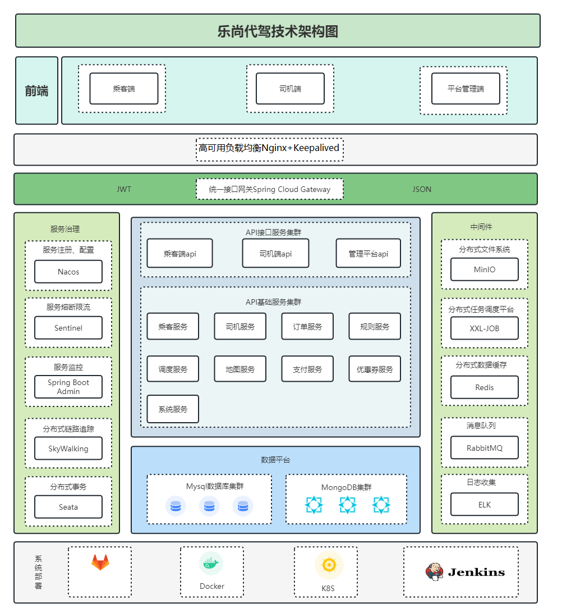

## **代驾项目**

#### **技术栈**
-----------------------------------------------------------------------------------------------

| 技术栈           | 版本    |
|---------------|:------|
| JDK           | 17    |
| SpringBoot    | 3.0.5 |
| SpringCloud   | 4.0.2 |
| MySQL         | 5.7   |
| MongoDB       | 0     |
| Redis         | 7.4.2 |
| MyBatis-Plus  | 3.5.3 |
| RabbitMQ      | 4.0.7 |
| Nacos         | 2.1.1 |
| Sentinel      | 0     |
| Seata         | 0     |
| SkyWalking    | 0     |
| Elasticsearch | 0     |
| Logstash      | 0     |
| Kibana        | 0     |
| Nginx         | 0     |
| XXL-Job         | 2.4.0 |

#### **第三方服务**
-----------------------------------------------------------------------------------------------

| 服务          | 地址  |
|-------------|-----|
| 腾讯云身份证识别    | https://cloud.tencent.com/document/product/866/103433    |
| 腾讯云行驶证识别    | https://cloud.tencent.com/document/product/866/36209    |
| 腾讯云驾驶证识别    | https://cloud.tencent.com/document/product/866/36213    |
| 腾讯云COS对象存储  | https://cloud.tencent.com/document/product/436    |
| 腾讯位置服务路线规划  | https://lbs.qq.com/service/webService/webServiceGuide/route/webServiceRoute    |
| 规则引擎        | https://www.drools.org/    |
| 任务调度XXL-Job | https://www.xuxueli.com/xxl-job/    |
